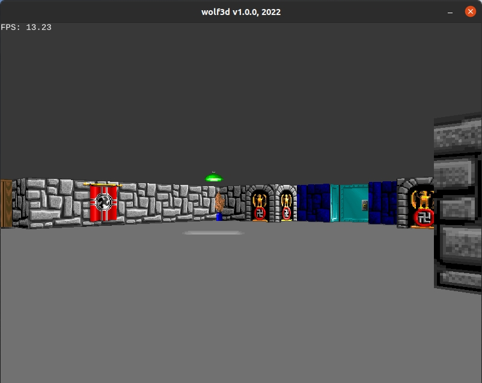

# Wolf3d v1

## Description

Based on the excellent work made by [Nhyarlathotep](https://github.com/Nhyarlathotep)

[A Wolf3D clone written in Rust for WebAssembly](https://github.com/Nhyarlathotep/Wolf3D-wasm)

[A Wolf3D Tile Map Editor made with React](https://github.com/Nhyarlathotep/Wolf3D-react-editor)

The code was adapted in order to use the ggez/gwg framework and also to implement the original game movement keys.



## Dependencies

* [Good Web Game](https://github.com/ggez/good-web-game)


## Build and run

```
cargo build --release

cargo run --release
```

## Controls

| Up Arrow              | `Move Forward`    |
| Down Arrow            | `Move Backward`   |
| Left Arrow            | `Turn Left`       |
| Right Arrow           | `Turn Right`      |
| RShift + Up Arrow     | `Run Forward`     |
| RShift + Down Arrow   | `Run Backward`    |
| RShift + Left Arrow   | `Fast Left Turn`  |
| RShift + Right Arrow  | `Fast Right Turn` |
| Alt + Left Arrow      | `Strafe Left`     |
| Alt + Right Arrow     | `Strafe Right`    |
| Ctrl                  | `Jump (Fire)`     |
| Space Bar             | `Open Doors`      |

## Author

* [Antonio Soares](https://github.com/ccie18473)

## License

This project is licensed under the [MIT] License - see the LICENSE.md file for details

